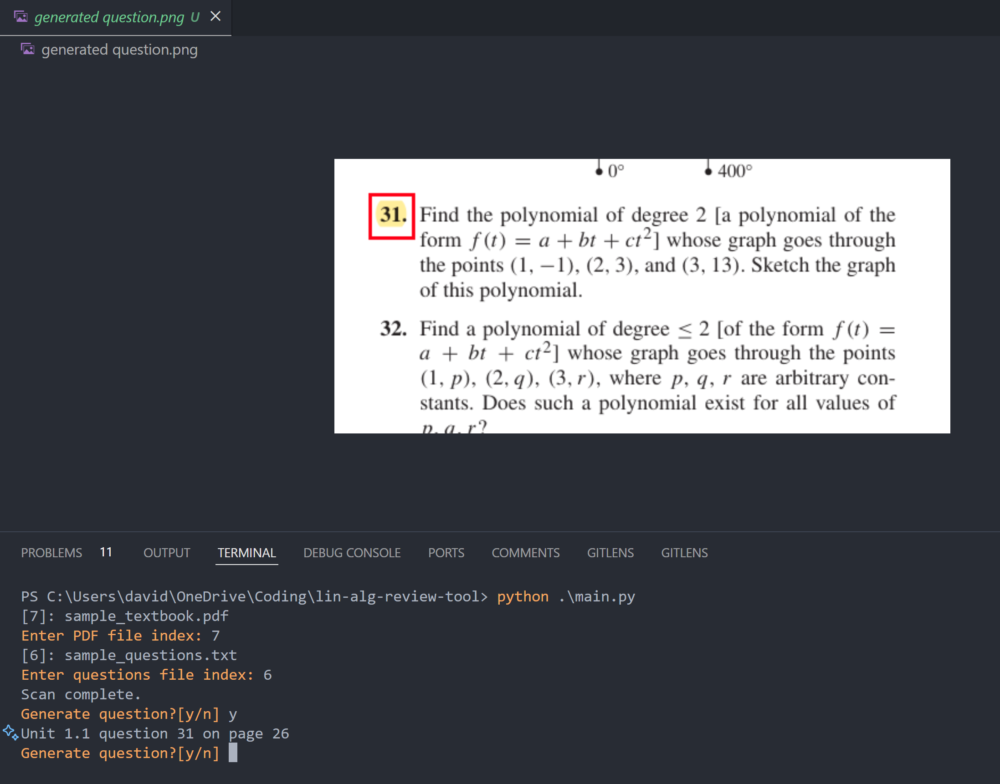

# Lin Alg Review Tool 🧮

Tired of studying the same problems over and over? This CLI tool extracts random problems from a customizable subset, keeping your Linear Algebra study sessions focused and fresh!

## Try it out!
- To get started, clone this repo and install the dependencies from the terminal using <code>$ pip install -r requirements.txt</code>
- Next, create a <code>.txt</code> file with your desired question set in the format <code>*chapter*, *q1*, *q2*, ...</code>. Check out <code>sample_questions.txt</code> for an example problem set.
- Finally, run <code>main.py</code> and follow the prompts in the terminal. Screenshots of generated questions will show up in the <code>generated_question.png</code> file.

Happy studying! 📚

## Known Issues
- "Screenshots" of problems are extracted with a fixed width/height, so some parts of a problem may be excluded from the resulting image. Potential solutions include extracting the entire page that a problem resides on, or using some sort of algorithm to identify problem boundaries (harder).
- Reading from sample_questions.txt could be made more readable and less error-prone by using the Pandas library.

